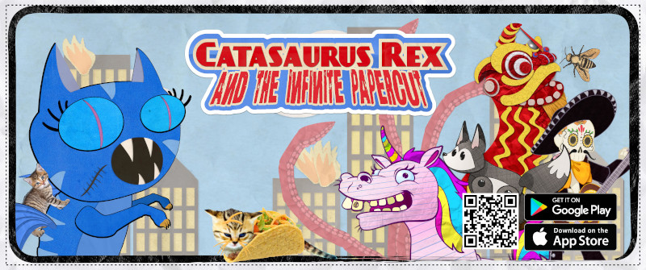
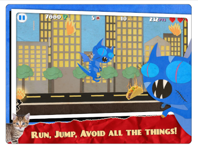
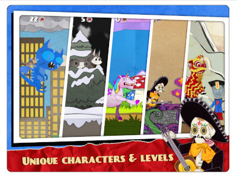
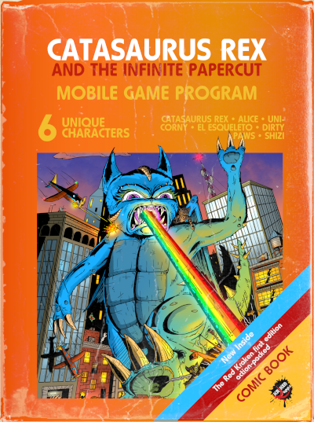
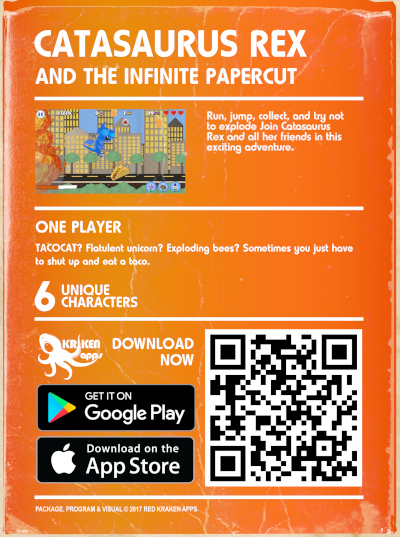
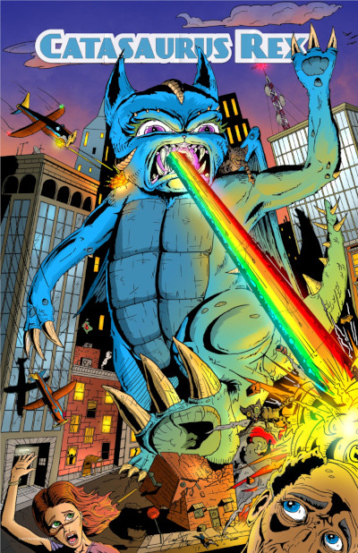
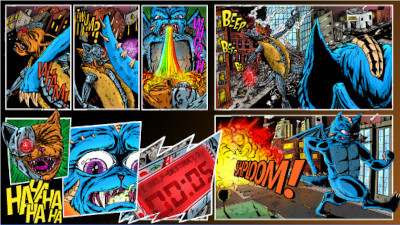
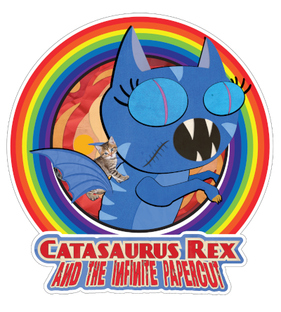

# Catasaurus Rex and the Infinite Papercut

**Platform:** iOS & Android  
**Engine:** Unity (2D)  
**Studio:** Red Kraken Apps, LLC  
**Released:** 2016  
**Recognition:** Indie Prize Honorable Mention — Casual Connect 2017 (San Francisco)

---

---

## Origin

This game started as a drawing my daughter made when she was eight years old. A cat. A dinosaur. Destroying a city. It was so committed to its own absurdity that I turned it into a full illustrated poster. A few years later, when I was bootstrapping my way into game development, I went back to that drawing and thought: *this is a character.*

That instinct turned out to be correct.

---

## What It Is

An infinite runner in the tradition of Temple Run and Subway Surfers — endless, pick-up-and-play, designed for short sessions. The hook was the character and the irreverence. Catasaurus Rex does not take herself seriously. Neither does the game.

**Core loop:** run, dodge, collect, die, try again.

**Six unlockable characters:** Catasaurus Rex · Alice · Unicorny · El Esqueleto · Dirty Paws · Shizi

**Monetization:** opt-in ad views grant in-game bonuses (low friction, player-controlled). Daily prizes. Leaderboards.

We also produced a full marketing suite built entirely in-house — including this Atari cartridge mockup, because why not.

---

## Gameplay

---

## How It Got Built

Two-person shop: one intern developer, one contracted character artist, and me handling everything else — game design, Unity development, UI, monetization logic, App Store optimization, social promotion, and the iOS port.

Unity Asset Store was used strategically to compress timeline, not to avoid learning. A small team shipping a small game has to be honest about where custom development creates value versus where it just creates delay.

The character art was contracted to an independent game artist. Directing an external creative on an original IP taught me more about art direction and communication overhead than any internal project had.

The marketing suite was built entirely in-house: key art, App Store screenshots, sticker sheets, a comic book cover, a print poster, and an Atari cartridge mockup. All of it part of building a world around the character, not just a game. The aesthetic consistency across formats was intentional -- the game needed to feel like it had always existed.

---

## What Happened at Launch

It launched. It was genuinely fun. It was genuinely lost.

Mobile game discoverability in 2016–2017 was brutal for anyone without a marketing budget or a platform relationship. We had neither. Downloads were modest. Retention was solid among players who found it — finding them was the problem.

---

## Casual Connect 2017

We were nominated for an Indie Prize at Casual Connect in San Francisco. I flew out, set up a table, and ran demos for two days.

One of the judges told me directly we weren't the committee's first choice — but her kid had played the game and refused to let it be cut.

That's the truest form of product-market fit: a kid demanding the thing stay in.

We didn't win. But the conversations on the floor led directly to the next project.

---

## What Came Next

A rep from Tapas Media approached me at the conference. They were building a program to partner indie devs with their comic IP library for tie-in games. Catasaurus Rex was proof we could deliver.

That conversation became **Dungeon Construction Co.** — a runner built on the same engine but around Tapas' licensed IP, developed in close collaboration with their artists over Zoom. It shipped. It performed modestly, partly because Tapas was pivoting their business focus and the promised marketing support didn't materialize.

The lesson: GTM ownership matters as much as product quality. A good product with a distracted distribution partner is still a product nobody finds.

---

## What I Learned

- A small, focused, well-characterized game can punch above its weight on charm alone
- Opt-in ad monetization with a player benefit outperforms forced interruption for retention
- Contracted creative relationships require as much direction and communication overhead as internal ones
- Platform discoverability is a product problem, not a marketing afterthought — it has to be designed in from the start
- Speed matters: the follow-up title, Turkey Dash, went from concept to App Store in under two months solo. That compression was only possible because of what I built and learned here

---

## Status

No longer live — platform updates eventually made re-certification uneconomical. The codebase and assets live here as a historical artifact and a reminder that the best starting point for a product is sometimes a kid's crayon drawing.

